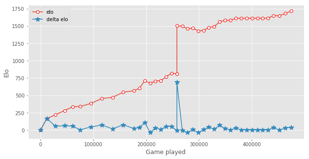
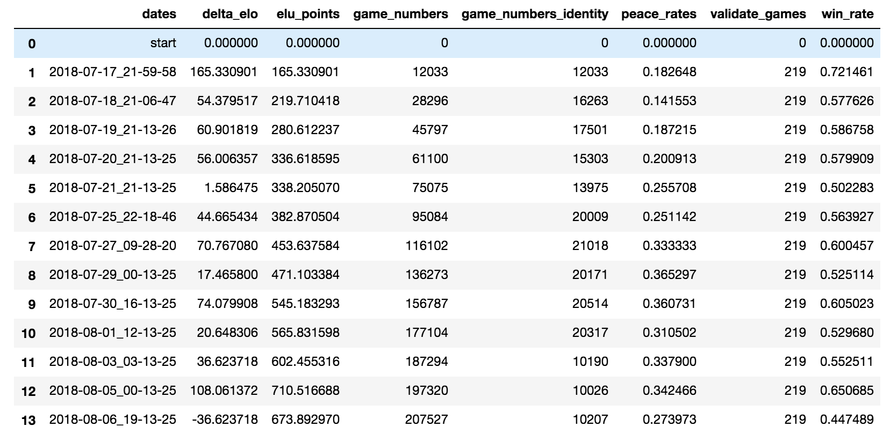
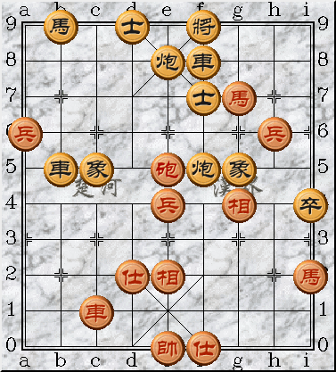

# icyChessZero 中国象棋alpha zero 

这个项目受到alpha go zero的启发，旨在训练一个中等人类水平或高于中等人类水平的深度神经网络，来完成下中国象棋的任务。目前这个项目仍在积极开发中，并且仍然没有完成全部的开发，欢迎pull request 或者star。 然而受到计算资源限制，这样庞大的任务不可能在一台机器上完成训练，这也是我完成了分布式训练代码的原因，希望各位小伙伴能够加入，一起训练这样一个中国象棋alpha go的网络。

我的估计是达到4000～5000elo分数的时候深度网络可以达到目标，现在深度网络已经到了3000分的边缘，达到人类中上水平的目标并不是不可能的。

目前的elo：



详细胜率表：



当然，目前棋力还比较一般，因为是从完全随机开始训练的，比方说某个对局片段(800 playouts)：



# 推荐代码运行环境
* python==3.6.0
* tensorflow==1.4.0
* threadpool==1.3.2
* xmltodict==0.11.0
* urllib3==1.22
* numpy==1.14.3
* tflearn==0.3.2
* pandas==0.19.2
* scipy==1.1.0
* matplotlib==2.0.0
* tqdm==4.19.4
* tornado==4.5.1(集群master必须安装，slave不需要)
* uvloop==0.9.1(windows可不装)

# 推荐机器环境
* 机器在北京邮电大学机房中（不加入我们的集群或者自组集群可以不管这条）
* windows 或 linux服务器
* 16G以上内存
* 4个以上CPU物理核
* 一张以上能够进行深度学习运算的显卡

# 加入我们的集群训练(北邮校内only)
目前我们的集群已经有四台gpu机器(两台windows，两台linux)在夜以继日地运行，我们需要更多，如果你恰好有北邮机房内闲置的gpu服务器的权限，希望你加入我们，一起训练中国象棋的alpha go zero。

集群分为master和slave，加入集群的机器均为slave，master和slave分工如下：
* slave : 负责自动从master拉取最新模型权重，完成自对弈，并且把棋谱自动上传到master
* master: 负责给slave提供权重，并且负责模型的更新，评估，以及从slave接收棋谱

如果你想要加入我们的训练：

1. 首先联系我 qq/微信： 892009517  ;邮箱：icybee@yeah.net, 由于项目仍然在快速迭代，所以经常需要更新代码，与我联系获得最新的消息或代码更新的时间很必要。
2. 如果你实在不想联系我，那么可以进行如下操作，直接加入集群(不推荐)：

## windows 机器加入集群(北邮校内only)

clone工程后在cmd中执行下面命令

```
cd script

./multithread_start.bat [thread_number] [gpu_core] [python_env]
```

比如:

```
./multithread_start.bat 10 0 python3
```

意味着在0号GPU上用python3环境跑10个进程（一般一个1080ti GPU可以支持到至多24个进程），然而GPU并不是唯一瓶颈，不推荐跑超过物理核数两倍的进程数量。

## linux 机器加入集群（北邮校内only）

clone工程后在shell中执行

```
cd script

```
比如:

```
sh multithread_start.sh -t 10 -g 0 -p python3 
```

意味着在0号GPU上用python3环境跑10个进程（与上面windows版本对应)

## 总之
总之，如果想要加入集群，请先联系我，因为如果直接加入集群，可能会有我这边代码更新了然后部分slave没更新的情况，这样会造成不一致，后果会不可知。


# 自组集群
如果你在北邮没有机器，然而在校外有一些机器，希望能跑起来这样一个分布式程序，那么请按照下面的步骤做：

1. 确定你要这么做，这是一个耗时，昂贵，不讨好,但是有点意思的工作
2. 推荐你的机器（们）的环境满足推荐配置，并且安装好应该装的包
3. master 机器一定要是linux（目前没有支持master也是windows）
4. fork一份icyChessZero的代码,找到 ``` config/conf.py  ```这个文件，把server的ip改成你希望的master的ip
5. master 和slave分别clone这份fork的代码
6. 在master上```cd scripts```运行 ``` initize_weight.py ``` 生成第一份随机权重
7. 在master上```cd distribute```运行 ```distributed_server.py```开启master服务端口
8. 在slave机器上起slave进程的方法同上文"加入集群"
9. master上如果有空闲的资源可以起几个slave进程
10. 模型更新和validate的方法在scripts/daily_update.sh中，按照你的需求改这个shell文件，并且把它放到crontab中设置为每小时运行一次（它会检查棋谱数量，数量足够后它会执行模型更新和评估工作）

# 查看棋谱
slave机器运行出来的棋谱在 ```data/distributed``` 目录下，是cbf文件，可以通过"象棋桥"软件查看，也可以在 ``` ipynbs/see_gameplay.ipynb ``` 中查看

# 查看训练状态
master 机器可以在```ipynbs/elo_graph.ipynb``` 中查看集群训练的模型的elo到什么水平了。


# 没做的事
还有挺多东西可以做的，工程也还在快速开发,比如：
1. 给棋谱加上一些meta，比如每一步的mcts分析，方便查个别case

~~2.长将和长捉的判断还没有做~~

3. 给代码加上版本限制，master只接受与自己版本相同的slave的棋谱
4. 专门搞一个web ui实时展示elo和棋谱等
5. readme写清楚模块划分
.....

等等等等
如果你发现有你想做的，提提pull request或者联系我撒

这个work的一些细节已经以草稿的形式发布在了： http://icybee.cn/article/69.html

# 联系方式：
* QQ/wechat : 892009517
* 邮箱 : icybee@yeah.net 
